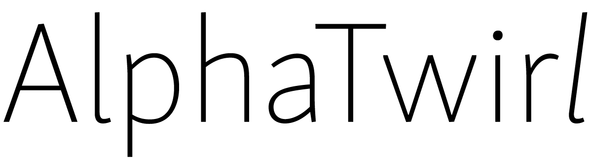

.. AlphaTwirl documentation master file, created by
   sphinx-quickstart on Sat May 23 14:38:44 2015.
   You can adapt this file completely to your liking, but it should at least
   contain the root `toctree` directive.

Home
****

*AlphaTwirl* is a python library that loops over event data and summarizes them
into multi-dimensional categorical data as data frames. Event data, input to
AlphaTwirl, are data with one entry (or row) for one event: for example, data in
`ROOT <https://root.cern.ch/>`_ `TTrees
<https://root.cern.ch/doc/master/classTTree.html>`_ with one entry per collision
event of an `LHC <https://home.cern/topics/large-hadron-collider>`_ experiment
at `CERN <http://home.cern/>`_. Event data are often large---too large to be
loaded in memory---because they have as many entries as events.
Multi-dimensional categorical data, the output of AlphaTwirl, have one row for
one category. They are usually small---small enough to be loaded in
memory---because they only have as many rows as categories. Users can, for
example, import them as data frames into `R <https://www.r-project.org/>`_ and
`pandas <http://pandas.pydata.org/>`_, which usually load all data in memory,
and can perform categorical data analyses with a rich set of data operations
available in R and pandas.
